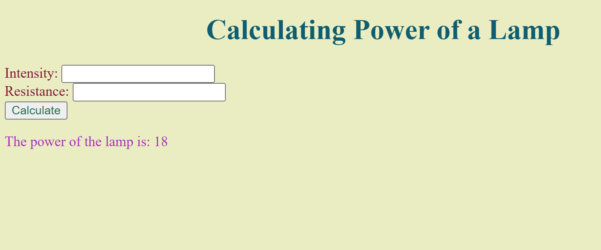
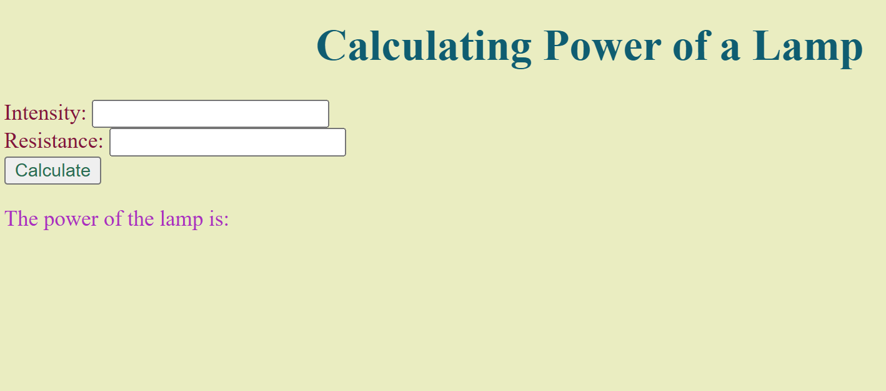

# Ex.05 Design a Website for Server Side Processing
# Date:11.04.25
# AIM:
To design a website to calculate the power of a lamp filament in an incandescent bulb in the server side.

# FORMULA:
P = I2R
P --> Power (in watts)
 I --> Intensity
 R --> Resistance

# DESIGN STEPS:
## Step 1:
Clone the repository from GitHub.

## Step 2:
Create Django Admin project.

## Step 3:
Create a New App under the Django Admin project.

## Step 4:
Create python programs for views and urls to perform server side processing.

## Step 5:
Create a HTML file to implement form based input and output.

## Step 6:
Publish the website in the given URL.

# PROGRAM :
```
viwes.py 

from django.shortcuts import render

def power(request):
    if request.method == 'POST':
        intensity_value = int(request.POST.get('intensity-input'))
        resistance_value = int(request.POST.get('resistance-input'))
        power = (intensity_value ** 2)*resistance_value
        return render (request, 'index.html', {'output':power})
    return render(request,'index.html')

index.html

<!DOCTYPE html>
<html lang="en">
<head>
    <meta charset="UTF-8">
    <meta name="viewport" content="width=device-width, initial-scale=1.0">
    <title>Document</title>
    <style type="text/css">
        body { background-color:  rgb(234, 237, 193); } 
        p   { color: rgb(172, 46, 191); }
        h1    { color: rgb(15, 93, 113); }
        form  { color: rgb(132, 22, 58)}
        button { color: rgba(18, 94, 64, 0.888)}
     </style>
 

</head>
<body>
    <h1 align="center">Calculating Power of a Lamp</h1>
    <form action="" method="POST">
        

        Intensity:
        <input type ="text" name = "intensity-input"><br>

        Resistance:
        <input type="text" name="resistance-input"><br>

        <button type="submit">Calculate</button>
        <p align=""center">The power of the lamp is: {{ output }}</p>
    </form>

    
</body>
</html>


urls.py

from django.contrib import admin
from django.urls import path
from web import views


urlpatterns = [
    
    path('',views.power, name='home'),
    
]
```

# SERVER SIDE PROCESSING:

# HOMEPAGE:

# RESULT:
The program for performing server side processing is completed successfully.
